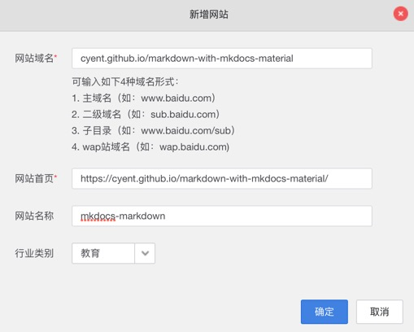
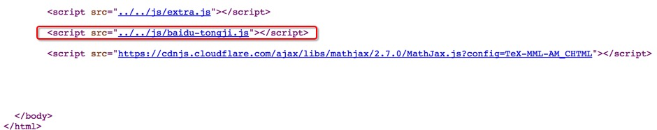

先在百度统计里创建添加站点，以本站为例:



确定后会看到javascript代码，复制代码

在docs目录下新建js目录，并在docs/js目录里放置baidu-tongji.js，将复制的代码粘贴进来，以本站为例:

```js
var _hmt = _hmt || [];
(function() {
  var hm = document.createElement("script");
  hm.src = "https://hm.baidu.com/hm.js?51fafb2ac8f80ecf43b05bb4cc281020";
  var s = document.getElementsByTagName("script")[0];
  s.parentNode.insertBefore(hm, s);
})();
```

最后在mkdocs.yml里新增如下配置:

```yaml
extra_javascript:
    - 'js/baidu-tongji.js'
```

效果: js会自动加在</body>前，以本站为例:


