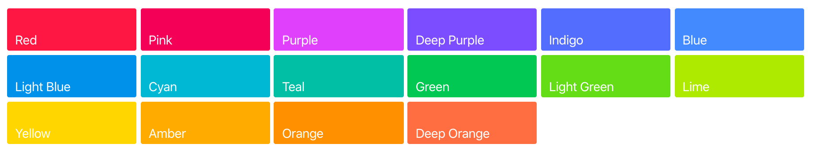

# 基于Material for MkDocs搭建静态博客

### 介绍

[MkDocs](https://www.mkdocs.org/) 是一个简单好用的静态网页生成器，而 [Material for MkDocs](https://squidfunk.github.io/mkdocs-material/) 是 Mkdocs 根据 Google 的 Material Design 指南构建的专门用于项目文档的一款主题。   


 本文基于 **Material for Mkdocs** 来搭建简洁、漂亮的个人博客，并部署在 **GitHub Homepage** 上，不需要额外搭建服务器，没有网页设计基础也可简单完成：

* Python 模块，符合 **Google Material UI** 规范的自定义主题；

* 针对特定语法、功能做了渲染优化；

* 根据客户端浏览器页面尺寸自动缩放，对 PC、移动设备都友好；

* 丰富的页面配色，多达 **19** 种主体配色和 **16** 种悬停链接文字配色；

* 支持多语言搜索；
* 支持添加 **Disqus** 用户评论功能；

* 支持统计功能，如百度统计，谷歌统计；   

  

### 安装 Mkdocs && Material

在终端中使用 `pip` 安装 Material

```python
pip install mkdocs mkdocs-material
```

!!! note "提醒"  
	在使用 pip 安装前，确保已安装 Python，本文使用的 Python 版本为 Python 3.7.4.

安装完成后，验证 Mkdocs 版本

```bash
mkdocs --version
# mkdocs, version 1.1
```

!!! note "提醒"  
		Material requires MkDocs >= 1.0.0.


### 创建新项目

```bash
mkdocs new my-project					# “my-project”为项目名称，可自定义
```

此时在当前路径下会生成一个名为”my-project“的文件夹，打开该文件夹可发现，它包含如下文件：

```bash
my-project/mkdocs.yml					# YAML 配置文件
my-project/Docs/index.md			# 主页内容
```


### 配置 YAML 文件

#### 项目信息

* site_name

这是**必要的设置**，并且应该是一个字符串，用作项目文档的主要标题。例如：

```yaml
site_name: My Docs
```

渲染主题时，此设置将作为`site_name`上下文变量传递。


* site_url

设置网站的URL地址。例如：

```yaml
site_url: https://xxxx.github.io
```

**默认值**：`null`


* site_description

设置站点说明，这会将meta标签添加到生成的HTML标头中。

**默认值**：`null`


* site_author

设置作者的姓名，这会将meta标签添加到生成的HTML标头中。

**默认值：**`null`


* repo_name

存储库名称，设置后在每个页面上提供指向您的存储库的链接的名称。

**默认值**：`'GitHub'`，`'Bitbucket'`或者`'GitLab'`如果`repo_url`匹配这些域，则为的主机名`repo_url`。


* repo_url

存储库地址，设置后在每个页面上提供指向您的存储库（GitHub，Bitbucket，GitLab等）的链接。例如:

```yaml
repo_url: https://github.com/example/repository/
```

**默认值**：`null`


* edit_uri

在线编辑路径，设置后，直接提供一个链接到源存储库中的页面。这使查找和编辑页面源变得更加容易。如果`repo_url`未设置，则忽略此选项。

!!! info "注意"  
	对于GitHub或GitLab托管的存储库，`edit_uri` 将自动设置为`edit/master/docs/`（请注意`edit`路径和`master`分支）。   
	
	对于由Bitbucket托管的存储库，等效项`edit_uri`将自动设置为`src/default/docs/`（请注意`src`路径和`default` 分支）。   
	
	要使用与默认值不同的URI（例如，不同的分支），只需将设置`edit_uri`为所需的字符串。如果您不希望在页面上显示任何“编辑URL链接”，请设置`edit_uri`为空字符串以禁用自动设置。  

!!! warning "注意"  
	在GitHub和GitLab上，默认的“编辑”路径（`edit/master/docs/`）在在线编辑器中打开页面。此功能要求用户拥有并登录到GitHub / GitLab帐户。否则，用户将被重定向到登录/注册页面。或者，使用“ blob”路径（`blob/master/docs/`）打开一个只读视图，该视图支持匿名访问。

**默认值**：`edit/master/docs/`用于GitHub和GitLab存储库或 `src/default/docs/`Bitbucket存储库（如果`repo_url`与这些域匹配），否则`null`


* docs_dir

包含文档源markdown文件的目录。它可以是相对目录，在这种情况下，它是相对于包含您的配置文件的目录来解析的，或者可以是从本地文件系统根目录开始的绝对目录路径。

**默认值**：`'docs'`


* copyright

设置要通过主题包含在文档中的版权信息。例如：

```yaml 
copyright: "Copyright &copy; 2019 - 2020 xxxx"
```

**默认值**：`null`


#### 页面风格

##### 启用 material 主题

```yaml
theme:
  name: 'material'
```


##### 配色

在Google的Material Design [调色板上](http://www.materialui.co/colors)，为每种主题色和强调色定义了默认色相，这使更改主题的整体外观非常容易。只需使用以下变量设置原色和强调色：

```yaml
theme:
  palette:
    primary: 'indigo'
    accent: 'indigo'
```

颜色名称不区分大小写，但必须与“材料设计”调色板的名称匹配。有效值是：`red`，`pink`，`purple`，`deep purple`，`indigo`，`blue`，`light blue`，`cyan`，`teal`，`green`，`light green`，`lime`，`yellow`，`amber`，`orange`，`deep orange`，`brown`，`grey`，`blue grey `和 `white`。后四种颜色只能用作主题色。

**主题色**


**强调色**




##### 网页Logo

Logo 应为矩形，最小分辨率为128x128，留出一定的边缘空间，并在透明地面上由高对比度区域组成，因为它将放置在彩色标题栏。只需创建文件夹`docs/images`，添加Logo并将其嵌入：

```yaml
theme:
  logo: 'images/logo.svg'
```

**默认值**： `school`

此外，可以通过从[Material Design图标字体中](https://material.io/icons/)设置任意连字（或Unicode代码点）来更改默认图标，例如:

```yaml
theme:
  logo:
    icon: 'cloud'
```


##### 网站图标

可以通过将`favicon`变量设置为`.ico`或图像文件来更改默认图标。

```yaml
theme:
  favicon: 'assets/images/favicon.ico'
```

**默认值**：`assets/images/favicon.png`


#### 文本风格

##### 语言

通过以下方式指定语言：

```yaml
theme:
  language: 'en'
```

material for mkdocs 支持国际化（i18n），并提供以下语言的所有模板变量和标签的翻译：

| Available languages           |                   |                                   |
| :---------------------------- | ----------------- | --------------------------------- |
| `af` / Afrikaans              | `ar` / Arabic     | `ca` / Catalan                    |
| `cs` / Czech                  | `et` / Estonian   | `de` / German                     |
| `hr` / Croatian               | `ja` / Japanese   | `ro` / Romanian                   |
| `da` / Danish                 | `nl` / Dutch      | `en` / English                    |
| `fi` / Finnish                | `fr` / French     | `gl` / Galician                   |
| `gr` / Greek                  | `he` / Hebrew     | `hi` / Hindi                      |
| `hu` / Hungarian              | `id` / Indonesian | `it` / Italian                    |
| `kr` / Korean                 | `no` / Norwegian  | `nn` / Norwegian                  |
| `fa` / Persian                | `pl` / Polish     | `pt` / Portugese                  |
| `ru` / Russian                | `sr` / Serbian    | `sh` / Serbo-Croatian             |
| `sk` / Slovak                 | `th` / Thai       | `vi` / Vietnamese                 |
| `si` / Slovenian              | `es` / Spanish    | `sv` / Swedish                    |
| `tr` / Turkish                | `uk` / Ukrainian  | `zh` / Chinese (Simplified)       |
| `zh-TW` / Chinese (Taiwanese) |                   | `zh-Hant` / Chinese (Traditional) |


##### 字体

默认情况下，主题包含[Roboto字体系列](https://fonts.google.com/specimen/Roboto)，尤其是文本的常规 sans-serif 类型和`monospaced`代码的类型。两种字体均从[Google字体](https://fonts.google.com/)加载，并且可以更改为其他字体，例如[Ubuntu字体家族](https://fonts.google.com/specimen/Ubuntu)：

```yaml
theme:
  font:
    text: 'Ubuntu'
    code: 'Ubuntu Mono'
```

文本字体将以权重400和700加载，`monospaced`字体以常规权重加载。如果您想从其他目标加载字体，或者不想使用Google字体加载，只需将其设置`font`为`false`：

```yaml
theme:
  font: false
```

**默认值**：`Roboto`和`Roboto Mono`


##### 文本方向

material 同时支持从左到右（`ltr`）和从右到左（`rtl`）文本方向。这使更多语言（例如阿拉伯语，希伯来语，叙利亚语和其他语言）可以与主题一起使用：

```yaml
theme:
  direction: 'rtl'
```

**默认值**：与给定主题语言的最佳匹配，自动设置


##### 标签

默认情况下，整个导航在左侧使用可折叠部分呈现，因为水平导航在较小的屏幕上经常会出现问题。但是，对于大型文档项目，有时需要添加另一个导航层来分隔顶层部分。material 通过 tabs 功能实现了这一点，可以通过将相应功能标记设置为来启用`true`：

```yaml
theme:
  feature:
    tabs: true
```

**默认值**：`fasle`

!!! info "注意"  
	启用标签页后，*顶层区域*将在标题正下方的附加层中呈现。左侧的导航将仅包含所选部分中包含的页面。此外，在项目的内部定义的*顶级页面*`mkdocs.yml`将被分组在第一个选项卡下，该选项卡将接收第一页的标题。


##### 导航栏

用于确定站点的全局导航的格式和布局。最简单的导航配置如下所示：

```yaml
nav:
    - 'index.md'
    - 'about.md'
```

!!! info "注意"  
	导航配置中的所有路径都必须相对于`docs_dir` 配置选项。如果该选项设置为默认值，`docs`则上述配置的源文件将位于`docs/index.md`和 `docs/about.md`。

上面的示例将导致在顶层创建两个导航项，并根据Markdown文件的内容（如果在文件中未定义标题的话）从文件名推断其标题。要覆盖`nav`设置中的标题，请在文件名之前添加一个标题：

```yaml
nav:
    - Home: 'index.md'
    - About: 'about.md'
```

!!! info "注意"  
	如果在导航中为页面定义了标题，则该标题将在该页面的整个站点中使用，并将覆盖页面本身内定义的任何标题。

可以通过在部分标题下列出相关页面来创建导航子部分。例如：

```yaml
nav:
    - Home: 'index.md'
    - User Guide:
        - 'Writing your docs': 'writing-your-docs.md'
        - 'Styling your docs': 'styling-your-docs.md'
    - About:
        - 'License': 'license.md'
        - 'Release Notes': 'release-notes.md'
```

通过上述配置，我们具有三个顶级项：“主页”，“用户指南”和“关于”。“首页”是指向该网站首页的链接。在“用户指南”部分下，列出了两个页面：“编写文档”和“样式化文档”。在“关于”部分下，又列出了两个页面：“许可证”和“发行说明”。


#### 扩展功能

##### 网站搜索

网站搜索是使用[lunr.js](https://lunrjs.com/)实现的，该默认情况下包括英语的单词，而其他语言的词干包含在[lunr-languages中](https://github.com/MihaiValentin/lunr-languages)，这两种[语言](https://github.com/MihaiValentin/lunr-languages)都与此主题集成在一起。素材为给定的主题语言选择匹配的（或最匹配的）词干。`mkdocs.yml`通过显式定义搜索语言，可以在项目的语言中激活多语言搜索：

```yaml
extra:
  search:
    language: 'en, de, ru'
```

网站搜索目前支持以下语言：

| Available language |                  |                  |                 |
| :-------------------------- | ---------------- | ---------------- | --------------- |
| `da` / Danish               | `du` / Dutch     | `en` / English   | `fi` / Finnish  |
| `fr` / French               | `de` / German    | `hu` / Hungarian | `it` / Italian  |
| `ja` / Japanese             | `no` / Norwegian | `pt` / Portugese | `ro` / Romanian |
| `ru` / Russian              | `es` / Spanish   | `sv` / Swedish   | `tr` / Turkish  |

可以对词的分隔符进行自定义，这可以索引由`-`或分隔的单词部分`.`：

```yaml
extra:
  search:
    tokenizer: '[\s\-\.]+'
```

!!! info "注意"  
	目前，Lunr语言不支持中文或其他亚洲语言。但是，实践证明，可使用日语来搜索中文。


##### 社交关系

在文档的页脚中链接社交帐户。`type`必须表示类型，例如`github`，`twitter`或者`linkedin`，`link`必须包含要链接的网址，例如：

```yaml
extra:
  social:
    - type: 'github'
      link: 'https://github.com/xxxx'
    - type: 'twitter'
      link: 'https://twitter.com/xxxx'
    - type: 'linkedin'
      link: 'https://www.linkedin.com/in/xxxx'
```


##### 谷歌分析

设置Google Analytics（分析）跟踪配置。MkDocs可轻松将网站跟踪与Google Analytics（分析）集成。除了基本跟踪之外，还可以跟踪所有传出链接的点击以及网站搜索的使用方式。可以在项目的中激活跟踪：

```yaml
google_analytics:
  - 'UA-XXXXXXXX-X'
  - 'auto'
```


##### 评论插件

material 已与[Disqus](https://disqus.com/) 集成在一起，因此，如果要在文档中添加注释部分，只需设置你在 Disqus 里的简称：

```yaml
extra:
  disqus: 'your-shortname'
```

!!! info "注意"  
	除了索引页面之外，所有页面上都会插入注释部分。此外，将在目录底部生成一个新条目，该条目链接到注释部分。

!!! info "前提"  
	`site_url`必须设置值，以使Disqus集成正确加载。

也可以使用在 markdown_extensions 安装 meta 为特定页面启用或禁用 Disqus (下述)。


##### Markdown扩展

MkDocs页面必须使用[Markdown](https://daringfireball.net/projects/markdown/)写作，Markdown是一种轻量级的标记语言，它导致易于阅读，易于编写的纯文本文档，并且可以以可预测的方式转换为有效的HTML文档。

MkDocs使用[Python-Markdown](https://python-markdown.github.io/)库将Markdown文档呈现为HTML。除了在所有Markdown实现中通用的 [基本Markdown语法](https://daringfireball.net/projects/markdown/syntax)，MkDocs还支持通过 [Python-Markdown扩展](https://python-markdown.github.io/extensions/) 语法。建议默认启用以下扩展：

```yaml
markdown_extensions:
	- admonition												# 注解块支持
  - pymdownx.arithmatex								# 数学公式的TeX语法支持
  - pymdownx.betterem:
      smart_enable: all
  - pymdownx.caret
  - pymdownx.critic
  - pymdownx.details
  - pymdownx.emoji:										# 表情支持
      emoji_generator: !!python/name:pymdownx.emoji.to_svg
  - pymdownx.inlinehilite
  - pymdownx.magiclink
  - pymdownx.mark
  - pymdownx.smartsymbols
  - pymdownx.superfences
  - pymdownx.tasklist:								# 任务清单支持
      custom_checkbox: true
  - pymdownx.tilde
  - meta															# 元数据支持
```

* 使用 **arithmatex** 时，除了激活扩展之外，还需要在`mkdocs.yml`中包括MathJax JavaScript：

```yaml
extra_javascript:
  - 'https://cdnjs.cloudflare.com/ajax/libs/mathjax/2.7.0/MathJax.js?config=TeX-MML-AM_CHTML'
```

* 使用 **meta** ，为特定页面启用或禁用 Disqus：

  元数据在Markdown文档的开头以一系列键值对的形式编写，并由结束元数据上下文的空白行分隔。

```yaml
# 可以在每个文档启用Disqus：
disqus: your-shortname
  
# 可以通过将特定页面设置为空值来禁用Disqus：
disqus:
```

  

### 开发服务器

MkDocs包含一个开发服务器，因此可以随时在本地进行浏览、更改。

在 mkdocs.yml 同一路径下，使用以下命令启动开发服务器：  

```yaml
mkdocs serve
```

现在，可以将浏览器中输入地址 [http://localhost:8000](http://localhost:8000/), 来预览网页效果。


### 生成网页

在 mkdocs.yml 同一路径下，使用以下命令依据 mkdocs.yml 配置文件，生成网页：

```yaml
mkdocs build
```

成功后，将在项目文件夹下生成一个名为 site 的文件夹，其中包含了所有生成的网页。

将 **site 文件夹下的所有文件**拷贝到项目根目录下，与 **docs文件夹及其包含的文本**，共同组成**网页资源**。

当我们部署网页时，只需要将上述**网页资源**进行部署即可（**忽略 mkdocs.yml 和 site 文件夹**）。


### 将网页部署到 GitHub Pages

##### Step 1 创建新仓库

登录 [GitHub](https://github.com)，在右上角选择 New repository，创建新仓库。


##### Step 2 配置仓库信息

在仓库设置页面，**Repository_name**设置成 **xxxx**.github.io，其中 **xxxx** 是你 GitHub 的用户名。

选择 **Public** ，点击 **Create repository**.


##### Step 3 上传网页资源到仓库

将生成的网页资源上传到刚刚创建的仓库中（使用 Git 相关命令或直接使用 GitHub Desktop 软件进行操作，这里不再叙述）。


##### Step 4 部署到 GitHub Pages

打开仓库，点击仓库功能栏的 **Setting**，进入到仓库设置页面。

在设置页面找到 **GitHub Pages** 部分，在 **Source** 这里选择 **master branch**。


部署成功后，便可以通过 **xxxx.github.io** 来访问你的网页。


### Reference

https://www.mkdocs.org/

https://squidfunk.github.io/mkdocs-material/

