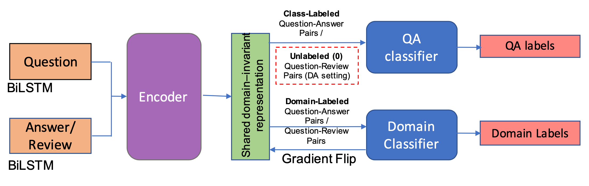

## Learning to Answer Subjective, Specific Product-Related Queries using Customer Reviews by Adversarial Domain Adaptation

### 1 问题描述

给定一特定产品相关的有标注的问题-答案对 $Q-A$ 和无标注的问题-评论对 $Q-R$，训练一个分类模型，在输入一个问题-评论对 $Q-R$ 时，判断评论 $R$ 是否可以回答问题 $Q$。

### 2 模型描述

#### 2.1 模型概述

本文提出了一个领域对抗神经网络(Domain Adversarial Neural Network, **DANN**)。它采用领域适应的方法，在有标注的问题-答案对(QA)和无标注的问题-评论对(QR)上来学习领域不变的特征，实现从答案领域迁移到评论领域。

该模型包含编码器、QA 分类器和 领域分类器三个部分。在编码器中，分别将问题 $q$ 和答案/评论 $a/r$ 编码成向量表示 $V_q、V_{a/r}$；然后将这些向量表示拼接成成对的数据 $“V_q\oplus V_{a}”$ 和 $“V_q\oplus V_{r}”$；将问题-答案对 $V_q\oplus V_{a}$ 输入到 QA 分类器中来预测是否答案 $a$ 可以回答问题 $q$ ；将问题-答案对 $V_q\oplus V_{a}$ 和问题-评论对 $V_q\oplus V_{r}$ 都输入到领域分类器来预测当前的输入是答案 $a$ 还是评论 $r$。QA 分类器和领域分类器都使用交叉熵作为损失函数来进行反向传播。模型训练完成后，屏蔽领域分类器，输入问题-评论对 $Q-R$，在 QA 分类器上来预测是否评论 $R$ 可以回答问题 $Q$。

DANN 模型的结构如下图所示。

#### 2.2 细节实现

##### 编码器

在此阶段，使用 $\text{Bi-LSTM}$ 分别将问题 $q$ 和 答案/评论 $a/r$ 编码成向量表示

$$
V_q = \text{Bi-LSTM}(q).
$$

$$
V_{a/r} = \text{Bi-LSTM}(a/r).
$$

然后将 $V_q$ 分别和 $V_a$ 、$V_r$ 拼接成 $[V_q;V_a]$ 和 $[V_q;V_r]$。

##### QA 分类器

QA 分类器由两层全连接层构成，在训练阶段，QA 分类器的输入为问题-答案对 $[V_q;V_a]$，预测答案 $a$ 是否可以回答问题 $q$

$$
l^{qa} = \text{Linear}([V_q;V_a]).
$$

在测试阶段，QA 分类的输入为问题-评论对 $[V_q;V_r]$，预测评论 $r$ 是否可以回答问题 $q$

$$
l^{qr} = \text{Linear}([V_q;V_r]).
$$

##### 领域分类器

领域分类器也由两层全连接层构成，在训练阶段，领域分类器的输入为问题-答案对 $[V_q;V_a]$ 和问题-评论对 $[V_q;V_r]$，预测输入是答案 $a$ 还是评论 $r$

$$
l^{ar} = \text{Linear}(V). \quad V \in \{[V_q;V_a],[V_q;V_r]\}
$$

在训练时，领域分类器反向传播时进行梯度翻转操作，即将梯度的负值向前传播，以消除领域特定的特征，保留领域不变的特征。

在测试阶段，领域分类器被屏蔽，不再使用。

### 参考文献

Manirupa Das, Zhen Wang, Evan Jaffe, Madhuja Chattopadhyay, Eric Fosler-Lussier, and Rajiv Ramnath. **Learning to Answer Subjective, Specific Product-Related Queries using Customer Reviews by Adversarial Domain Adaptation.** arXiv 2019. [[paper](https://arxiv.org/pdf/1910.08270)]

