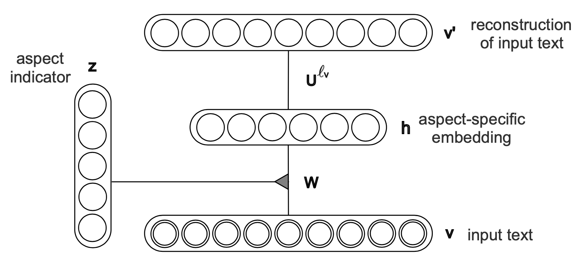

# Review-Aware Answer Prediction for Product-Related Questions Incorporating Aspects

### 1 问题定义

对于一个特定的产品，用 Q 来表示该产品一系列的 “$Yes-No$" 类型的问题，用 $a ∈ {Yes, No}$ 来表示每个问题 $q ∈ Q$ 的答案，用 $R$ 来表示该产品相关的所有评论的集合；基于已有的问题-答案对 $Q-A$  和评论 $R$，在提出新的问题 $q$ 时，来预测答案 $a$ ，同时给出支持该答案 $a$ 的评论 .

### 2 模型描述

#### 2.1 模型概述

本文提出了一个包含两个模块的模型，分别是属性分析模块(aspect analytics model)和答案预测模块(predictive answer model)，属性分析模块由 3阶自编码器构成，包含输入文本 $v$、$L$ 个属性指示器 $z$、$L$ 个属性特定的隐层表示 $h$ 和重构的输入 $v’$，该模块的目的是通过学习得到参数矩阵 $W$ 和 $U$ ，当输入评论文本 $r$ 或问题 $q$ 时，计算得到该输入文本确定的属性指示器 $z$ ($L$个) 和属性特定的隐层表示 $h$ ($L$个)。

答案预测模块是在给定问题 $q$ 和评论集合 $R$ 时，来预测问题的答案 $a$ ；当输入问题 $q$ 时，通过训练好的属性分析模块计算出 $q$ 所属的 $z^l$ 和 $h^l_q$，将属于第 $l$ 个属性的评论构成集合 $R^l$，对于 $R^l$ 中的每条评论 $r$ 作为属性分析模块的输入来计算嵌入 $h^l_r$ ，通过 $h^l_q$ 和 $h^l_r$ 来得到针对每个 $q$ 和 $r$ 的答案 $a(q, r)$，再通过对 $r$ 和 $l$ 加权求和，得到问题的最终答案 $a_{q^*}$；最后，将 $a(q, r)$ 与最终答案 $a_{q^*}$ 相同的评论筛选出，计算其与 $q$ 的相似度 $S^l_{a_{q^*}}(q, r)$，按排序最前的评论 $r*$ 作为回答的证据（支持性评论）。

#### 2.2 属性分析模块

属性分析模块(Aspect Analytics Model, **AAM**)，目的是在所有产品相关的评论中检测和捕捉潜在的属性，使用无监督的学习方法，学习评论/问题文本与属性之间的复杂关系。

##### AAM 模型结构

AAM 由一个 3-阶自编码器构成，其结构如图所示：

它由输入层、属性指示层、属性特定的嵌入层和重构层组成。其中 $v$ 表示输入文本，是一个维度与词表长度 $K$ 相同的向量；$z$ 表示属性指示器， 是一个 $L$ 维的向量，每一维代表一个属性；$h$ 表示属性特定的嵌入，维度为 $J$，每个属性都对应着一个特定的嵌入向量；$v'$ 表示重构后的输入，维度与输入的 $v$ 相同；参数矩阵 $W$ 和 $U$ 都是3阶矩阵。

##### 学习过程

首先，给定一个输入文本 $v$ ，它对于每个属性的相关概率通过一个 $softmax$ 函数来计算   

$$
P(z^l|v) = \frac{exp[-F(v,z^l)]}{\sum_{l^*}exp[-F(v,z^{l^*})]}
$$

其中  

$$
F(v,z^l) = -∑^J_j log\left[1 + exp\left(\sum^K_k W^l_{kj} v_k + c_j\right)\right] - d^l
$$

对于任意所选的属性 $z^l$ , 我们可以计算每个隐层结点的激活概率 $h_j$  

$$
P(h_j|v, z^l) = σ\left(\sum^K_k W^l_{kj} v_k + c_j\right)
$$

其中 $σ$ 是 $sigmoid$ 函数.  

由 $P(z^l|v)$ 计算出的输入文本 $v$ 在每个属性上的概率，我们选择概率最大的属性作为优势属性 $z^{l_v}$ ,可知 $z^{l_v}$ 是由输入文本 $v$ 确定的. 3阶自编码器的编码器利用参数 $W^{l_v}_{kj}(∀k, ∀j)$ 来将输入的评论文本 $v$ 通过计算 $P(h_j|v,z^{l_v})$ 转换为 属性 $z^{l_v}$ 的嵌入 $h$ ; 然后解码器利用参数 $U^{l_v}$ 来将嵌入 $h$ 重构成输入文本 $v'$   

$$
P(v'_k|h,z^{l_v}) = σ\left(\sum^J_j U^{l_v}_{kj} h_j - b'_k\right)
$$

#### 2.3 答案预测模块

答案预测模块(Predictive Answer Model), 目的是利用通过 AMM 训练得到的基于属性的分布和属性特定的嵌入，捕捉问题、评论和相关的答案之间的关系，从而预测新的问题的答案并给出证据(支持性评论).

##### 答案预测

首先，将给定的问题 $q$ 作为 AAM 的输入v，计算出问题 $q$ 的属性分布 $P(z^l|q)$ , 同时将整个评论集合 $R$ 依据评论的优势属性划分成不同的子集 $R^l$  

$$
R^l = \{r ∈ R | l = argmax_{l^*} \ P(z^{l^*}|r)\}
$$

对于每个属性 $z^l$ , 计算 $R^l$ 中每条评论 $r$ 与问题 $q$ 之间的相关性 $S^l(q,r)$  

$$
S^l(q,r) = \frac{cos(z_q, z_r)}{\sum_{r^* ∈ R^l}cos(z_q, z_{r^*})}
$$

对于 $R^l$ 中的每条评论 $r$ ，都对问题 $q$ 计算一次答案为 $Yes$ 的概率  

$$
P^l(Yes|q,r) = σ(h^l_q · M · h^l_r)
$$

其中 $M$ 为参数矩阵.

最后，对每个属性 $z^l$ 和评论子集 $R^l$ 进行加权求和，计算问题 $q$ 的最终答案 $a^*_q$   

$$
P(Yes|q,R) = \sum_{l∈L}P(z^l|q)\sum_{r∈R^l}S^l(q,r)P^l(Yes|q,r)
$$

$$
P(No|q,R) = 1 - P(Yes|q,R)
$$

##### 支持性评论

假设问题 $q$ 预测的最终答案为 $a^*_q$ , 即 $a^*_q = argmax_{a∈\{YEs,No\}}\ P(a|q,R)$ , 我们定义可解释性得分函数 $S^l(q,r)$  

$$
S^l_{a^*_q}(q,r) = 
	\begin{cases}
		S^l(q,r) & P(a^*_q|q,r) > 1/2 \\
		0				 & \text{otherwise}
	\end{cases}
$$

将每条评论按照 $S^l(q,r)$ 进行排序，得分较高的评论选作预测答案的证据.

### 参考文献

Qian Yu and Wai Lam. **Review-Aware Answer Prediction for Product-Related Questions Incorporating Aspects.** WSDM 2018. [[paper](https://dl.acm.org/doi/proceedings/10.1145/3159652)]

