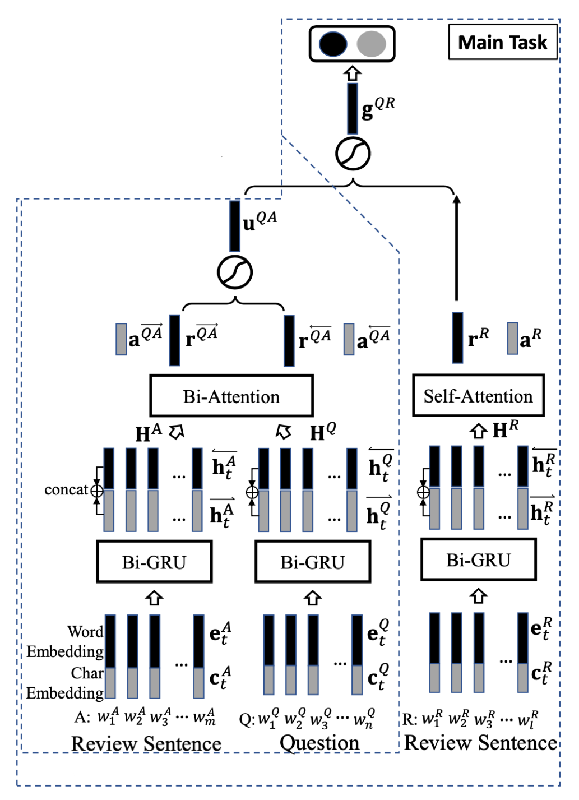

## Answer Identification from Product Reviews for User Questions by Multi-Task Attentive Networks

### 1 问题定义

给定一个标注的 $QR$ 对的集合 $S^{qr} = \{(Q,R,y^{QR})\}$ ，其中 $Q$ 是一个用户已提交的问题，$R$ 是一个评论语句，$y^{QR}∈\{0,1\}$ 是推断 $R$ 是否可以回答问题 $Q$ 的二元标签。同时，还有一个从用户问答数据中自动标注的 $QA$ 对的集合 $S^{qa} = \{(Q,A,y^{QA})\}$ ，其中 $y^{QA}∈\{0,1\}$ ，表示 $A$ 是否可以回答问题 $Q$。基于集合 $S^{qr}$ 和 $S^{qa}$ 为 **QR​ task** 训练一个分类模型，对于一个新的 $QR$ 对 $(Q^{new},R^{new})$ ，该模型能够准确地预测出 $R^{new}$ 是否可以回答问题 $Q^{new}$。

### 2 模型描述

#### 2.1 模型概述

本文提出了一个包含 **QA task** 和 **QR task** 任务的多任务深度学习模型 **QAR-Net**，其中，QR task 为主任务，QA task 为辅助任务，它们都包含文本编码、注意力池化、融合和输出四个阶段。在模型训练时，首先在 QA task 上进行预训练，然后在QR task 进行微调。

对于 QA task，只对 QA-Net 在集合 $S^{qa} = \{(Q,A,y^{QA})\}$ 进行预训练；在文本编码阶段，分别对问题 $Q$ 和 答案 $A$ 通过词嵌入和字符嵌入拼接成向量后，使用双向 GRU 进行编码得到隐层表示 $H^Q$ 和 $H^A$；在注意力池化阶段，对 $H^Q$ 和 $H^A$ 使用双向注意力机制来学习问题焦点和答案模式之间的映射关系，得到注意加权的表示 $r^{\overset{\longrightarrow}{QA}}$ 和 $r^{\overset{\longleftarrow}{QA}}$，在融合阶段，将  $r^{\overset{\longrightarrow}{QA}}$ 和 $r^{\overset{\longleftarrow}{QA}}$ 融合激活得到 $u^{QA}$，最终在输出阶段使用 $u^{QA}$ 进行分类预测。

对于 QR task，预训练的 QA-Net 的基础上加入 R-Net 在集合 $S^{qr} = \{(Q,R,y^{QR})\}$ 上进行微调，**注意此时 A-Net 的输入为评论 $R$** 。在文本编码阶段，分别对问题 $Q$ 和评论 $R$ 通过词嵌入和字符嵌入拼接成向量后，使用双向 GRU 进行编码得到隐层表示 $H^Q$ 和 $H^R$；在注意力池化阶段，对于 QA Net， $H^Q、H^R$ 使用双向注意力机制来学习问题焦点和答案模式之间的映射关系，得到 $r^{\overset{\longrightarrow}{QA}}$ 和 $r^{\overset{\longleftarrow}{QA}}$，对于 R-Net， $H^R$ 使用自注意力机制来学习评论语句中与焦点相关的内容，得到  $r^R$；在融合阶段，将 QA-Net 的  $r^{\overset{\longrightarrow}{QA}}$ 和 $r^{\overset{\longleftarrow}{QA}}$ 融合激活得到 $u^{QA}$ 后，与 R-Net 的 $r^R$ 融合激活得到 $g^{QR}$，最终在输出阶段使用 $g^{QR}$ 进行分类预测。

#### 2.2 QA task

QA 辅助任务，目的是学习问题焦点和答案模式的映射关系。在此任务中，只使用 QA-Net 在集合 $S^{qa} = \{(Q,A,y^{QA})\}$ 上进行预训练。

##### 模型结构

QA task 包含 Q-Net 和 A-Net，其结构如下

##### 文本编码

用 $Q=<w_t^Q>^n_{t=1}$ 和 $A = <w_t^A>^m_{t=1}$ 分别表示问题和答案序列；序列中的每个词 $w_t$ 首先被转换成词级别的嵌入向量  $e_t$ 和字符级别的嵌入向量 $c_t$，然后将 $e_t$ 与 $c_t$ 拼接后送入双向 GRU 网络来获得低层次的表示 $h_t$

$$
\overset{\rightarrow}{h_t} = \overset{\longrightarrow}{GRU}(\overset{\longrightarrow}{h_{t-1}}, e_t \oplus c_t). \quad \overset{\rightarrow}{h_t} \in \mathbb{R}^u
$$

$$
\overset{\leftarrow}{h_t} = \overset{\longleftarrow}{GRU}(\overset{\longleftarrow}{h_{t+1}}, e_t \oplus c_t). \quad \overset{\leftarrow}{h_t} \in \mathbb{R}^u
$$

$$
h_t = \overset{\rightarrow}{h_t} \oplus \overset{\leftarrow}{h_t}. \quad h_t \in \mathbb{R}^{2u}
$$

我们用列向量来表示 $h_t$，从而每个序列可表示成矩阵 $\text{H}$；对于 Q 和 A，有 $\text{H}^Q \in \mathbb{R}^{2u \times n}, \text{H}^A \in \mathbb{R}^{2u \times m}$。

##### 注意力池化

在 QA task 中，使用双向注意力机制来提取问题焦点和答案模式，如图所示。

首先，计算 $\text{H}^Q$ 和 $\text{H}^A$ 的相似矩阵 $\text{G}$

$$
\text{G} = \mathbb{tanh}((\text{H}^A)^T \text{U} \text{H}^Q). \quad \text{G} \in \mathbb{R}^{m \times n}
$$

其中，$\text{U} \in \mathbb{R}^{2u \times 2u}$ 为参数矩阵。然后将 $\text{G}$ 分别对行、列求和（求和池化）后计算注意力权重

$$
a^\overset{\rightarrow}{QA} = \mathbb{softmax}(\text{RowSum(G)}). \quad a^\overset{\rightarrow}{QA} \in \mathbb{R}^m
$$

$$
a^\overset{\leftarrow}{QA} = \mathbb{softmax}(\text{ColSum(G)}). \quad a^\overset{\leftarrow}{QA} \in \mathbb{R}^n
$$

最后，计算注意力加权的 $\text{QA}$ 表示

$$
r^\overset{\rightarrow}{QA} = \text{H}^Aa^\overset{\rightarrow}{QA}. \quad r^\overset{\rightarrow}{QA} \in \mathbb{R}^{2u}
$$

$$
r^\overset{\leftarrow}{QA} = \text{H}^Qa^\overset{\leftarrow}{QA}. \quad r^\overset{\leftarrow}{QA} \in \mathbb{R}^{2u}
$$

##### 融合 & 输出

首先，将 $r^\overset{\rightarrow}{QA}$ 和 $r^\overset{\leftarrow}{QA}$ 融合激活

$$
u^{QA} = \text{tanh}(\text{W}^{\overset{\rightarrow}{qa}}r^\overset{\rightarrow}{QA} + \text{W}^{\overset{\leftarrow}{qa}}r^\overset{\leftarrow}{QA}). \quad u^{QA} \in \mathbb{R}^{2u}
$$

其中，$\text{W}^{\overset{\rightarrow}{qa}}$ 和 $\text{W}^{\overset{\leftarrow}{qa}}$ 是 $2u \times 2u$ 的参数矩阵。最后使用 $u^{QA}$ 来预测标签

$$
\hat{g}^{QA} = \sigma((\text{w}^{qa})^T u^{QA} + b^{qa}).
$$

#### 2.3 QR task

QR 主任务，目的是在预训练的 QA-Net 上使用集合 $S^{qa} = \{(Q,A,y^{QA})\}$ 进行微调，学习问题焦点、答案模式和评论中焦点内容之间的关系。

##### 模型结构

QR task 除包含 QA task 的 Q-Net 和 A-Net 外，还包含 R-Net，其结构如下

在 QR task 中，模型左侧的 QA-Net 只需将 A-Net 的输入变为评论 R，按 QA task 相同的处理方式依次进行文本编码、注意力池化和融合过程，得到 $u^{QR}$。对于右侧的 R-Net 处理方式如下。

##### 文本编码

用 $R=<w_t^R>^l_{t=1}$ 来表示评论序列；经过与 QA task 中文本编码过程相同的处理，可得到矩阵 $\text{H}^R \in \mathbb{R}^{2u \times l}$。

##### 注意力池化

在 QR task 中，对矩阵 $\text{H}^R$ 使用自注意力机制来提取评论中的焦点内容

$$
a^R = \text{softmax}(\text{v}^T \text{tanh}(\text{U}^r \text{H}^R)). \quad a^R \in \mathbb{R}^l
$$

$$
r^R = \text{H}^R a^R. \quad r^R \in \mathbb{R}^{2u}
$$

其中，$\text{U}^r \in \mathbb{R}^{k \times 2u}, \text{v} \in \mathbb{R}^k$ 为自注意力机制的参数。

##### 融合 & 输出

将 QA-Net 得到的 $u^{QR}$ 和 R-Net 得到的 $r^R$ 进行融合激活

$$
g^{QR} = \text{tanh}(\text{W}^{qr}u^{QR} + \text{W}^r r^R). \quad g^{QR} \in \mathbb{R}^{2u}
$$

最后，使用 $g^QR$ 来预测最终标签

$$
\hat{y}^{QR} = \sigma((\text{w}^{qr})^T g^{QR} + b^{qr}).
$$

### 参考文献

Long Chen, Ziyu Guan, Wei Zhao, Wanqing Zhao, Xiaopeng Wang, Zhou Zhao, and Huan Sun. **Answer Identification from Product Reviews for User Questions by Multi-Task Attentive Networks.** AAAI 2019. [[paper](https://wvvw.aaai.org/ojs/index.php/AAAI/article/view/3767/3645)]

