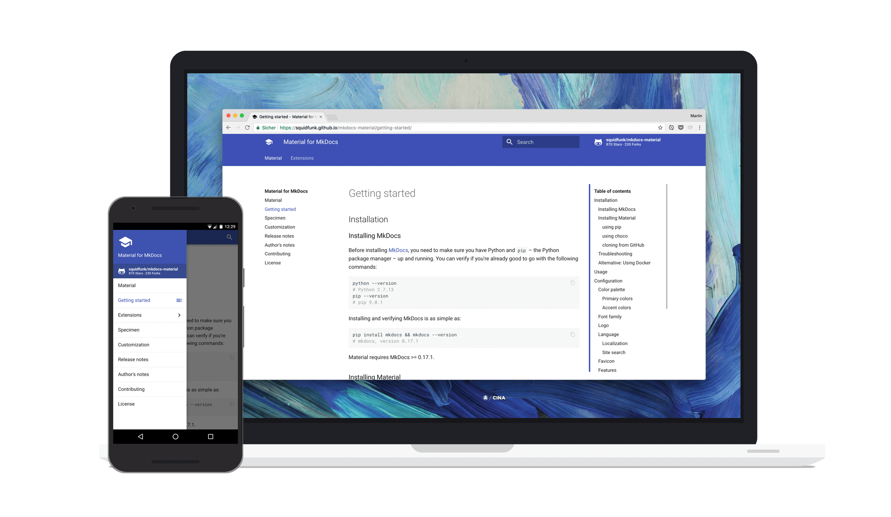

[MkDocs](https://www.mkdocs.org/) 是一个简单好用的静态网页生成器，而 [Material for MkDocs](https://squidfunk.github.io/mkdocs-material/) 是 Mkdocs 根据 Google 的 Material Design 指南构建的专门用于项目文档的一款主题。   

 本文基于 **Material for Mkdocs** 来搭建简洁、漂亮的个人博客，并部署在 **GitHub Homepage** 上，不需要额外搭建服务器，没有网页设计基础也可简单完成：

* Python 模块，符合 **Google Material UI** 规范的自定义主题；

* 针对特定语法、功能做了渲染优化；

* 根据客户端浏览器页面尺寸自动缩放，对 PC、移动设备都友好；

* 丰富的页面配色，多达 **19** 种主体配色和 **16** 种悬停链接文字配色；

* 支持多语言搜索；
* 支持添加 **Disqus** 用户评论功能；

* 支持统计功能，如百度统计，谷歌统计；