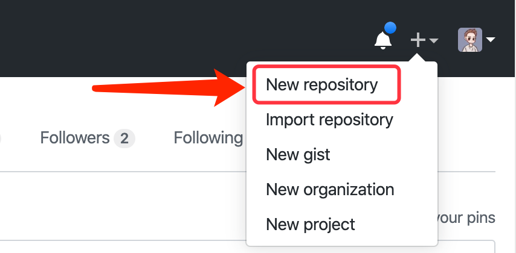
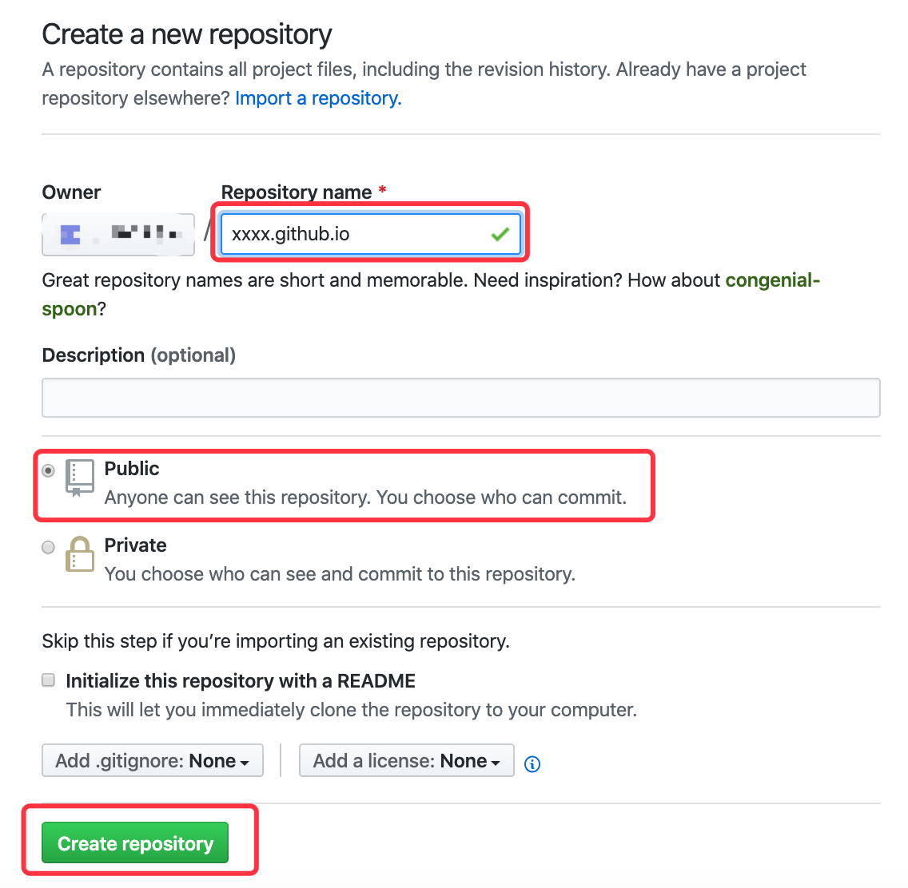
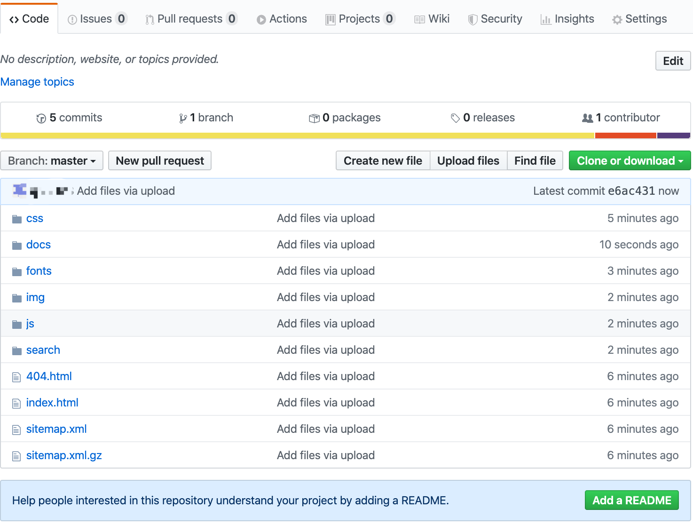
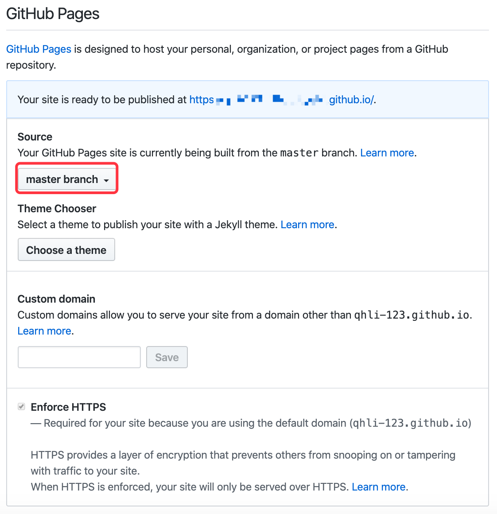

##### Step 1 创建新仓库

登录 [GitHub](https://github.com)，在右上角选择 New repository，创建新仓库。

##### Step 2 配置仓库信息

在仓库设置页面，**Repository_name**设置成 **xxxx**.github.io，其中 **xxxx** 是你 GitHub 的用户名。

选择 **Public** ，点击 **Create repository**.

##### Step 3 上传网页资源到仓库

将生成的网页资源上传到刚刚创建的仓库中（使用 Git 相关命令或直接使用 GitHub Desktop 软件进行操作，这里不再叙述）。

##### Step 4 部署到 GitHub Pages

打开仓库，点击仓库功能栏的 **Setting**，进入到仓库设置页面。

在设置页面找到 **GitHub Pages** 部分，在 **Source** 这里选择 **master branch**。

部署成功后，便可以通过 **xxxx.github.io** 来访问你的网页。

